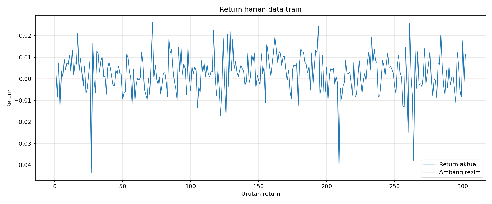
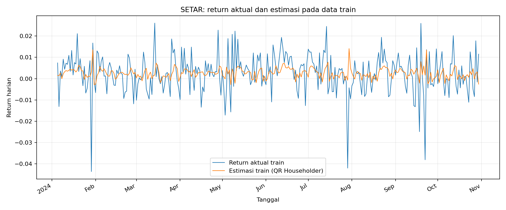
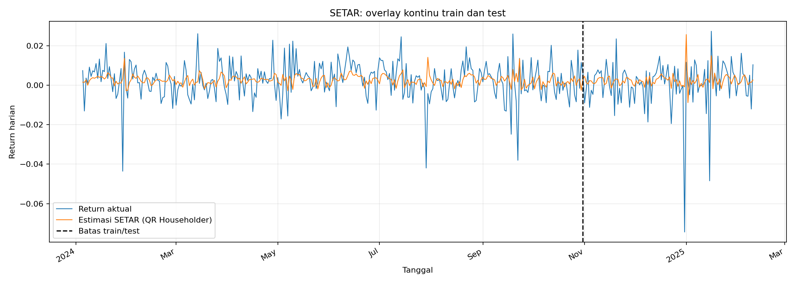

# Laporan Teknis Nomor 2 — Model SETAR

**Kelompok C9**

# Nomor 2 bagian i — Formulasi matriks overdetermined

Harga Close train berjumlah 303. Return harian dihitung sebagai \(R_t=(P_t-P_{t-1})/P_{t-1}\), sehingga terdapat 302 return. Untuk lag order 2, baris matriks dimulai pada indeks return ke-3. Rezim ditentukan dari tanda return lag-1: \(R_{t-1}\ge0\) bullish dan \(R_{t-1}<0\) bearish.

Baris desain menggunakan urutan parameter \(x=[\alpha_1,\phi_{1,1},\phi_{1,2},\alpha_2,\phi_{2,1},\phi_{2,2}]^T\). Untuk rezim bullish barisnya \([1,R_{t-1},R_{t-2},0,0,0]\); untuk bearish \([0,0,0,1,R_{t-1},R_{t-2}]\). Target adalah \(b=R_t\).

Dimensi sistem: \(A\in\mathbb{R}^{300\times6}\), \(x\in\mathbb{R}^6\), dan \(b\in\mathbb{R}^{300}\). Baris bullish: 195; baris bearish: 105. Sistem overdetermined karena 300 > 6.

Data yang digunakan ulang tersedia di `i/return_train_i.csv`, `i/matriks_A_i.csv`, dan `i/vektor_b_i.csv`.

---

# Nomor 2 bagian ii — Investigasi isu numerik

Matriks desain berukuran \(300\times6\), berpangkat 6 dari 6 parameter. Condition number 2-norm \(\kappa_2(A)\) adalah 192.60541. Norma kolom beragam: minimum 0.08897615, maksimum 13.96424; perbedaan skala ini dapat membuat pengujian pivot berdasarkan ambang absolut saja kurang andal.

Membandingkan pembentukan \(A^TA\) dengan float32 dan float64 menghasilkan galat absolut maksimum 1.6104009e-07 dan galat relatif maksimum 8.2584661e-10. Galat float32/float64 tidak seharusnya diharapkan nol; perbedaan tersebut adalah akibat pembulatan floating point. Risiko yang lebih besar muncul ketika persamaan normal membentuk \(A^TA\), sebab \(\kappa_2(A^TA)\approx\kappa_2(A)^2\), sehingga galat pembulatan lebih kuat memengaruhi solusi. Rank penuh pada data ini menunjukkan tidak ada kolom yang redundan secara numerik pada toleransi rank NumPy.

Mitigasi teknis yang disarankan:

1. Simpan harga, return, dan matriks dalam float64; jangan menurunkan presisi sebelum membentuk matriks.
2. Gunakan QR Householder sebagai solver utama karena transformasi ortogonal menghindari pembentukan \(A^TA\).
3. Bila persamaan normal dipakai sebagai pembanding, gunakan partial pivoting dan tolak pivot yang nol atau terlalu kecil terhadap skala matriks.
4. Periksa rank, condition number, norma kolom, serta residual solusi; penskalaan kolom dapat dipertimbangkan bila rentang skala menghambat perhitungan, dengan parameter dikembalikan ke skala semula.

Metrik rinci tersedia dalam `ii/diagnostik_ii.csv`.

---

# Nomor 2 bagian iii — Penyelesaian via persamaan normal

Least squares \(Ax\approx b\) diselesaikan dengan \(A^TAx=A^Tb\). Implementasi membentuk kedua ruas dan menyelesaikan sistem 6x6 menggunakan eliminasi Gauss dengan partial pivoting, lalu substitusi balik. Algoritma utama tidak memanggil solver pustaka.

Pseudocode: bentuk \(M=A^TA\), \(y=A^Tb\); untuk tiap kolom pilih baris dengan nilai pivot absolut terbesar, tukar baris, eliminasi elemen di bawah pivot; periksa pivot relatif terhadap skala matriks; lakukan substitusi balik.

| Parameter | Nilai |
|---|---:|
| alpha1 | 0.00151337422439 |
| phi11 | 0.172152897275 |
| phi12 | 0.166072850953 |
| alpha2 | -0.00121268855387 |
| phi21 | -0.360376823937 |
| phi22 | -0.109808038547 |

Condition number 2-norm hasil power iteration: \(\kappa_2(A)=192.6054102\), \(\kappa_2(A^TA)=37096.84403\). Karena \(\kappa_2(A^TA)\approx\kappa_2(A)^2\), pembentukan persamaan normal memperburuk sensitivitas terhadap pembulatan. Untuk dataset ini rank(A) = 6 dari 6 dan residual \(\|Ax-b\|_2=0.1529770499\). Solusi normal tersedia di `iii/koefisien_normal_iii.csv`.

---

# Nomor 2 bagian iv — Penyelesaian LSP dengan QR Householder

## Metode dan alasan pemilihan

Kelompok C9 bernomor ganjil, sehingga metode QR yang ditugaskan adalah Householder Reflections. Matriks desain SETAR berukuran \(m\times 6\), dengan \(m=300\) dan enam koefisien. Investigasi bagian ii menunjukkan rank penuh 6, condition number 2-norm \(\kappa_2(A)=192.60541\), dan norma kolom berkisar 0.08897615 hingga 13.96424. Matriksnya tall dan full rank, tetapi kolom-kolom prediktor memiliki skala berbeda. Refleksi Householder menghilangkan elemen subdiagonal secara ortogonal, mempertahankan norma 2, dan menghindari pembentukan \(A^TA\), yang akan menaikkan condition number kira-kira menjadi kuadratnya. Ini memberi alasan numerik dan struktur-spesifik untuk memakai QR, sementara solusi tetap diperoleh dari sistem segitiga atas.

## Langkah algoritma

1. Salin \(A\) ke \(R\), dan salin \(b\) ke \(y\).
2. Untuk setiap kolom \(k\), bentuk vektor refleksi \(v_k\) dan \(H_k=I-2v_kv_k^T/(v_k^Tv_k)\); terapkan refleksi pada bagian aktif \(R\) dan \(y\).
3. Setelah \(R\) menjadi segitiga atas, selesaikan \(R_{1:6,1:6}x_{LS}=y_{1:6}\) dengan substitusi balik.

Solver tidak menggunakan fungsi pustaka untuk faktorisasi atau penyelesaian SPL. Implementasi menerapkan refleksi melalui perkalian vektor dan outer product.

## Refleksi pertama dan verifikasi

Untuk kolom pertama, \(x=A_{:,1}\), \(\alpha=-\mathrm{sign}(x_1)\|x\|_2=-13.9642400438\). Dengan \(v=x-\alpha e_1\), refleksi pertama adalah \(H_1=I-\beta vv^T\), dengan \(\beta=2/(v^Tv)=0.00512820512821\). Matriks penuh berukuran \(300\times300\) tersedia di `iv/H1_iv.csv`; perkalian matriksnya tersedia di `iv/H1A_iv.csv`.

Perkalian \(H_1A\) menghasilkan struktur berikut pada delapan baris pertama (seluruh matriks tersedia di `iv/H1A_iv.csv`):

| Kolom 1 | Kolom 2 | Kolom 3 | Kolom 4 | Kolom 5 | Kolom 6 |
|---:|---:|---:|---:|---:|---:|
| -1.39642400e+01 | -1.03522935e-01 | -4.47421625e-02 | 0.00000000e+00 | -1.73472348e-18 | 0.00000000e+00 |
| 0.00000000e+00 | -3.58891009e-05 | -1.15237693e-02 | -7.16114874e-02 | 5.95787276e-04 | -1.74588806e-04 |
| 0.00000000e+00 | 0.00000000e+00 | 0.00000000e+00 | 1.00000000e+00 | -1.30962462e-02 | 7.37754225e-03 |
| 0.00000000e+00 | -3.83057282e-03 | -1.63002990e-02 | -7.16114874e-02 | 5.95787276e-04 | -1.74588806e-04 |
| 0.00000000e+00 | -6.46168221e-03 | 3.78805728e-04 | -7.16114874e-02 | 5.95787276e-04 | -1.74588806e-04 |
| 0.00000000e+00 | 1.71729159e-03 | -2.25230367e-03 | -7.16114874e-02 | 5.95787276e-04 | -1.74588806e-04 |
| 0.00000000e+00 | -3.00665880e-03 | 5.92667014e-03 | -7.16114874e-02 | 5.95787276e-04 | -1.74588806e-04 |
| 0.00000000e+00 | -1.59003670e-04 | 1.20271975e-03 | -7.16114874e-02 | 5.95787276e-04 | -1.74588806e-04 |

Norma seluruh elemen subdiagonal kolom pertama, \(\|(H_1A)_{2:m,1}\|_2\), adalah **0.000000e+00** (toleransi verifikasi 1.40e-09). Elemen pertama kolom itu menjadi \(\alpha\), sedangkan elemen di bawahnya nol hingga galat pembulatan.

## Solusi

| Parameter | \(x_{LS}\) |
|---|---:|
| alpha1 | 0.00151337422439 |
| phi11 | 0.172152897275 |
| phi12 | 0.166072850953 |
| alpha2 | -0.00121268855387 |
| phi21 | -0.360376823937 |
| phi22 | -0.109808038547 |

Ukuran sistem: \(A\in\mathbb{R}^{300\times 6}\), \(b\in\mathbb{R}^{300}\), \(x_{LS}\in\mathbb{R}^6\). Norma residual \(\|Ax_{LS}-b\|_2\) = **0.15297705**. Norma bagian bawah-diagonal \(R\) setelah QR = 1.704147e-16.

---

# Nomor 2 bagian v — Perbandingan performa dan pengaruh outlier

Matriks train berukuran **300 x 6**. Penyimpanan masukan bersama \(A,b\) adalah 16,800 byte pada float64 dan tidak dihitung sebagai workspace tambahan.

| Metode | FLOPs perkiraan | Workspace tanpa \(Q\) eksplisit (byte) | Workspace dengan \(Q\) eksplisit (byte) | Residual train \(L_2\) |
|---|---:|---:|---:|---:|
| QR Householder | 25056 | 19,248 | 739,248 | 0.152977049914 |
| Persamaan Normal | 21744 | 720 | 720 | 0.152977049914 |

Perkiraan QR menggunakan \(2mn^2-\frac{2}{3}n^3\) untuk faktorisasi dan sekitar \(2mn\) untuk mentransformasikan ruas kanan. Persamaan Normal menggunakan sekitar \(2mn^2\) untuk membentuk \(A^TA\), lalu \(\frac{2}{3}n^3\) untuk eliminasi pada sistem kecil. Estimasi workspace memperhitungkan array kerja solver (tidak termasuk masukan bersama A dan b dan temporary internal NumPy); penyimpanan matriks ortogonal penuh menambah \(m^2\) elemen (720,000 byte). Implementasi solver QR di bagian iv menerapkan refleksi secara implisit dan hanya membentuk \(H_1\) eksplisit untuk verifikasi.

Condition number yang dihitung oleh prosedur bagian iii: \(\kappa_2(A)=192.60541\) dan \(\kappa_2(A^TA)=37096.844\). Selisih residual kedua metode adalah 0.000000e+00. QR secara umum lebih stabil karena tidak membentuk \(A^TA\), yang menguadratkan condition number.

Outlier ekstrem pada return berpengaruh kuadrat terhadap fungsi objektif least squares. Satu observasi ekstrem dapat menaikkan residual dan menggeser koefisien agar lebih mengikuti observasi tersebut. Karena itu residual besar dapat mencerminkan shock pada data, bukan hanya kekurangan solver; pemeriksaan return ekstrem dan evaluasi out-of-sample tetap diperlukan.

---

# Nomor 2 bagian vi — Evaluasi out-of-sample

Model dilatih hanya dengan data train (\(A\in\mathbb{R}^{300\times 6}\)). Setiap prediksi test adalah one-step ahead: lag awal menggunakan dua return train terakhir, target pertama memasukkan perubahan dari harga train terakhir ke harga test pertama, dan target berikutnya menggunakan return aktual sebelumnya. Dengan demikian 103 harga test menghasilkan 103 return target test.

| Metode | RMSE train | RMSE test | Residual train \(L_2\) |
|---|---:|---:|---:|
| QR Householder | 0.00883213409479 | 0.0119670801055 | 0.152977049914 |
| Persamaan Normal | 0.00883213409479 | 0.0119670801055 | 0.152977049914 |

Metode dengan RMSE test terkecil adalah **QR Householder**. Jika RMSE kedua metode berbeda tidak lebih dari toleransi numerik \(10^{-12}\), QR dipilih karena lebih stabil secara numerik daripada persamaan normal. Pilihan ini dan semua prediksi per tanggal tersimpan dalam berkas CSV bagian vi.

---

# Nomor 2 bagian vii — Interpretasi finansial dan visualisasi

Metode yang digunakan adalah **QR Householder**, dipilih memakai aturan evaluasi bagian vi. RMSE train = 0.0088321341; RMSE test = 0.01196708.

Model SETAR hasil estimasi:

- **Bullish** (\(R_{t-1}\ge 0\)): \(\widehat{R}_t=0.001513374224+(0.1721528973)R_{t-1}+(0.166072851)R_{t-2}\).
- **Bearish** (\(R_{t-1}<0\)): \(\widehat{R}_t=-0.001212688554+(-0.3603768239)R_{t-1}+(-0.1098080385)R_{t-2}\).

Interpretasi koefisien lag:

| Rezim | Koefisien | Nilai | Interpretasi tanda |
|---|---|---:|---|
| Bullish | \(\phi_{1,1}\) | 0.1721528973 | positif: pengaruh searah dengan return lag (kecenderungan momentum) |
| Bullish | \(\phi_{1,2}\) | 0.166072851 | positif: pengaruh searah dengan return lag (kecenderungan momentum) |
| Bearish | \(\phi_{2,1}\) | -0.3603768239 | negatif: pengaruh berlawanan arah dengan return lag (kecenderungan mean-reverting) |
| Bearish | \(\phi_{2,2}\) | -0.1098080385 | negatif: pengaruh berlawanan arah dengan return lag (kecenderungan mean-reverting) |

Tanda koefisien menyatakan arah pengaruh linear parsial dari return lag, bukan jaminan bahwa tren pasar akan berlanjut atau berbalik. Grafik [overlay_train_vii.png](vii/overlay_train_vii.png) membandingkan aktual dan estimasi train. [overlay_train_test_vii.png](vii/overlay_train_test_vii.png) menggabungkan kedua segmen waktu dengan garis batas yang jelas.

## Grafik pendukung

